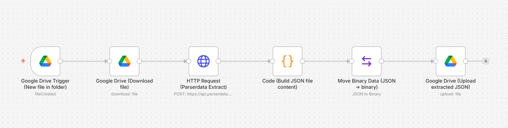

# Parserdata + n8n: Google Drive Document Extraction

Automatically extract structured data from documents uploaded to Google Drive using **n8n** and the **[Parserdata API](https://parserdata.com/parserdata-api)**
, then save clean JSON results back to Drive.

No prior n8n experience required.





## What this workflow does

This automation creates a fully hands-off document processing pipeline:

1. Watches a Google Drive folder
2. Detects newly uploaded files
3. Downloads the document
4. Sends it to the Parserdata extraction API
5. Cleans the API response
6. Saves the extracted data as a JSON file back to Google Drive

Once activated, everything runs automatically.

---

## Requirements (Step 0: Before you start)

You will need:

- An **n8n instance** (cloud or self-hosted)
- A **Google Drive account**
- A **Parserdata API key**

---

## Step 1: Create a new workflow in n8n

1. Open **n8n**
2. Click **New Workflow**
3. Give the workflow a name, for example:

Google Drive → Parserdata Extract → JSON

---

## Step 2: Add Google Drive Trigger (New file in folder)

This node watches a Google Drive folder and starts the workflow automatically.

1. Add node → **Google Drive Trigger**
2. Configure the node:

- **Trigger On**: `Specific Folder`
- **Event**: `File Created`
- **Folder To Watch**: Select your input folder (for example: `Invoices`)
- **Polling**: Every minute (default is fine)

3. Authenticate Google Drive  
   (standard Google OAuth popup)

**What this does:**  
Whenever a new file appears in the selected folder, the workflow starts automatically.

---

## Step 3: Download the file from Google Drive

Now we need the actual file content.

1. Add node → **Google Drive**
2. Set:
   - **Operation**: `Download`
   - **File ID**:
     ```
     {{$json["id"]}}
     ```

3. Use the same Google Drive credentials

**What this does:**  
Downloads the detected file and converts it into binary data that can be sent to an API.

---

## Step 4: Send the file to Parserdata API (HTTP Request)

This is the most important step.

1. Add node → **HTTP Request**

### Basic settings
- **Method**: `POST`
- **URL**:
https://api.parserdata.com/v1/extract

### Authentication
- **Authentication Type**: Header Auth
- **Header Name**: `X-API-Key`
- **Header Value**: Your X-API-Key

### Body settings
- **Send Body**: enabled
- **Content Type**: `multipart/form-data`

### Body parameters (add one by one)

#### 1. Prompt
**Name:** prompt

**Value:** Extract invoice number, invoice date, supplier name, total amount, and line items (description, quantity, unit price, net amount).

#### 2. Options
**Name:** options

**Value:** {"return_schema":false,"return_selected_fields":false}

#### 3. File
- **Parameter Type**: Form Binary Data
- **Name**: file
- **Input Data Field Name**: data

### Advanced
- **Timeout**: `300000` (5 minutes)

**What this does:**  
Uploads the document to Parserdata and instructs the AI exactly which fields to extract.

---

## Step 5: Clean the API response (Code node)

The API response includes metadata. We want **only the extracted data**.

1. Add node → **Code**
2. Language: **JavaScript**
3. Paste the following code:

```js
const api = $json;

// Create a clean output filename
const inputName = (api.file_name || api.result?.fileName || 'document').toString();
const base = inputName.replace(/\.[^.]+$/, '');
const outName = `${base}_extracted.json`;

// Return ONLY the extracted result
return [{
  json: {
    outName,
    payload: api.result ?? api,
  }
}];
```

**What this does:**

Removes unnecessary API metadata

Keeps only extracted fields

Generates a clean JSON filename

---

## Step 6: Convert JSON to a file (Move Binary Data)

Google Drive requires files in binary format.

1. Add node → **Move Binary Data**

2. Configure:

**Mode:** JSON → Binary

**File Name:** {{$json.outName}}

**MIME Type:** application/json

**Keep Source:** enabled


**What this does:**
Turns structured JSON into a downloadable .json file.

---

## Step 7: Upload extracted JSON back to Google Drive

Final step: save the result.

1. Add node → **Google Drive**

2. Configure:

**Operation:** Upload

**Binary Data:** enabled

**File Name:** {{$binary.data.fileName}}

**Parent Folder:** Select your output folder (for example: Extracted Results)

**What this does:** Uploads the extracted JSON file back to Google Drive automatically.

---

## Step 8: Activate the workflow

1. Click **Save**
2. Click **Publish**

🎉 Done!

---

## What happens now (end-to-end flow)

1. You upload a document to Google Drive
2. n8n detects the new file
3. The file is downloaded
4. Sent to the Parserdata API
5. Data is extracted using AI
6. Clean JSON is generated
7. JSON is uploaded back to Drive

All steps are fully automated.

---

## Common beginner tips

- Start with one test document
- Inspect each node's output while testing
- If extraction results are incorrect, refine the prompt
- Keep field names consistent for downstream automation

---

## Importing this workflow into n8n

1. Download [`workflow/google-drive-parserdata.json`](workflow/google-drive-parserdata.json).
2. In n8n, click **Import from File**.
3. Select the downloaded JSON file.
4. Open the imported workflow and:
   - Set your **Google Drive credentials** on all Google Drive nodes.
   - Create an HTTP Header Auth credential with:
     - Header name: `X-API-Key`
     - Header value: `Your X-API-Key`
   - Replace `YOUR_INPUT_FOLDER_ID` and `YOUR_OUTPUT_FOLDER_ID` with your own Google Drive folder IDs.
5. Save and activate the workflow.

---

## Perfect for

This workflow is designed to fit a wide range of real-world automation and data extraction scenarios, including:

- **Invoice processing**  
  Automatically extract invoice numbers, due dates, line items, prices, and totals from supplier invoices.

- **Accounting automation**  
  Reduce manual data entry by converting financial documents into structured JSON for accounting systems.

- **ERP ingestion pipelines**  
  Feed clean, structured data directly into ERP systems for order tracking, reconciliation, or reporting.

- **CRM data enrichment**  
  Extract customer, order, or transaction data from documents and attach it to CRM records.

- **Back-office operations automation**  
  Streamline repetitive document handling tasks across finance, operations, and administration teams.

- **Supplier and purchase order processing**  
  Automatically process purchase orders, delivery notes, and supplier documents.

- **Financial reporting workflows**  
  Prepare structured data for dashboards, analytics, and downstream reporting tools.

- **Data preparation for analytics and BI tools**  
  Generate machine-readable JSON ready for data warehouses and BI platforms.

- **Startups and small teams**  
  Replace manual workflows with AI-driven automation using minimal infrastructure.

    ---

## License

MIT

---

## Need help or a custom setup?

This repository is a reference example.

If you need help tailoring it to your workflow, or want advice on a more advanced Parserdata API integration (custom schemas, scale, or production use), reach out to us: support@parserdata.com
